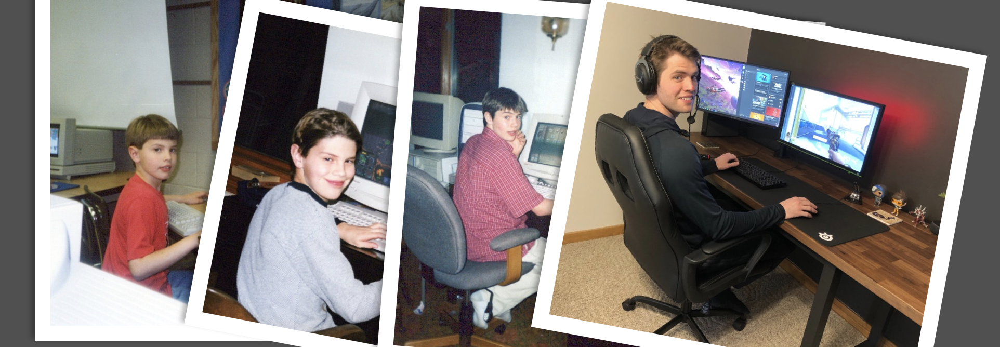

<h1>Hey there, I' Brian 👨🏼‍💻<h/1>
  <h3>I'm a Software Engineer building in Web3 (focused on gaming)</h3>
  <h4><i>Currently: Head of Blockchain Engineering - Stardust | previously: Meta</i></h4>
  <h3>Things I love:</h3>
  

    <ul>
      <li>Video games 🎮</li>
      <li>Decentralized and permissionless systems ⛓️</li>
      <li>User-centric, delightful design 🖐🏻</li>
      <li>Northern Michigan 🏞️</li>
    </ul>
  

  <h3>What I build:</h3>
  
In my free time, I build things me and my communities care about and want to use. I've grown my personal projects to over <b>150K MAU</b>, combining elements of gaming, web3, and consumer-minded design

  
